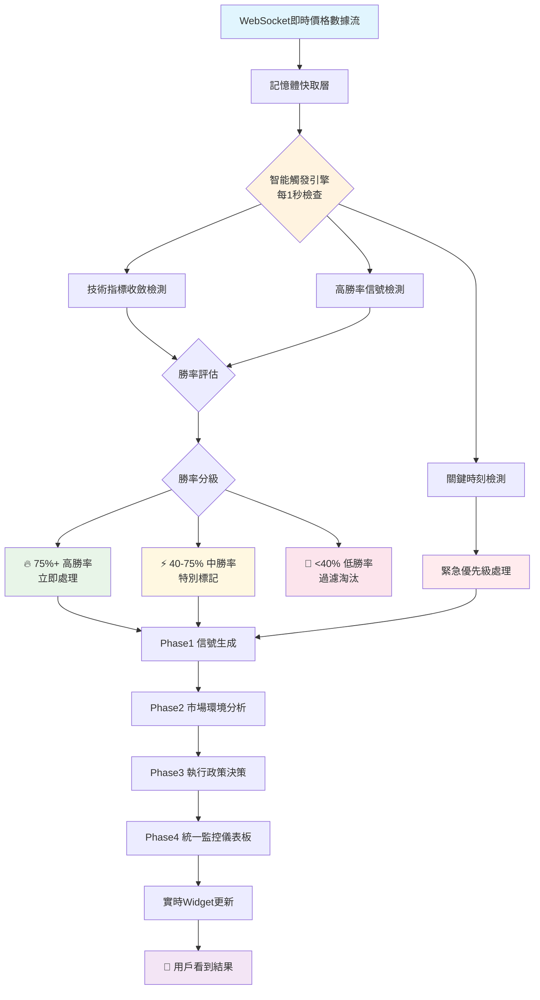

# 🏆 高勝率信號檢測優化策略流程

## 🎯 **系統架構概覽**



## 🔥 **Step 1: 即時數據層 (不變)**

```
WebSocket Driver v2.0 每100ms接收數據
    ↓
記憶體快取 (DataBuffer)
    ↓
6層處理管道:
├── Layer1: 數據驗證 (DataValidator)
├── Layer2: 數據清理 (DataCleaner)  
├── Layer3: 數據標準化 (DataStandardizer)
├── Layer4: 基礎計算 (BasicComputationEngine)
├── Layer5: 事件廣播 (EventBroadcaster)
└── Layer6: 路由分發 (RoutingTargets)

✅ 現有架構保持不變，無需修改
```

## 🧠 **Step 2: 智能觸發優化核心 (新增並行)**

### **2.1 高勝率檢測引擎**
```python
class HighWinRateDetectionEngine:
    """🏆 高勝率信號檢測引擎"""
    
    def __init__(self):
        self.win_rate_thresholds = {
            "high_priority": 75.0,     # 75%+ 勝率
            "medium_priority": 40.0,   # 40-75% 勝率
            "filter_threshold": 40.0   # <40% 過濾
        }
        self.backtest_engine = SniperBacktestEngine()
        self.cooldown_manager = CooldownManager()
    
    async def detect_high_win_rate_signals(self, data_snapshot: Dict) -> List[HighWinRateSignal]:
        """檢測高勝率信號"""
        
        # 1. 技術指標收斂分析
        convergence_signals = await self._analyze_indicator_convergence(data_snapshot)
        
        # 2. 歷史勝率驗證
        for signal in convergence_signals:
            historical_win_rate = await self._calculate_historical_win_rate(signal)
            signal.win_rate = historical_win_rate
            signal.priority = self._determine_priority(historical_win_rate)
        
        # 3. 實時回測驗證
        validated_signals = await self._realtime_backtest_validation(convergence_signals)
        
        # 4. 冷卻控制
        final_signals = await self._apply_cooldown_filter(validated_signals)
        
        return final_signals
```

### **2.2 技術指標收斂檢測**
```python
async def _analyze_indicator_convergence(self, data_snapshot: Dict) -> List[ConvergenceSignal]:
    """分析技術指標收斂情況"""
    
    indicators = data_snapshot.get('technical_indicators', {})
    convergence_signals = []
    
    # RSI + MACD + EMA 三重確認
    rsi = indicators.get('rsi', 50)
    macd_signal = indicators.get('macd_signal')
    ema_trend = indicators.get('ema_trend')
    
    # 多頭收斂
    if (rsi < 30 and 
        macd_signal == 'bullish' and 
        ema_trend == 'upward'):
        
        signal = ConvergenceSignal(
            direction='BUY',
            convergence_strength=self._calculate_convergence_strength([rsi, macd_signal, ema_trend]),
            supporting_indicators=['RSI', 'MACD', 'EMA']
        )
        convergence_signals.append(signal)
    
    # 空頭收斂
    elif (rsi > 70 and 
          macd_signal == 'bearish' and 
          ema_trend == 'downward'):
        
        signal = ConvergenceSignal(
            direction='SELL',
            convergence_strength=self._calculate_convergence_strength([rsi, macd_signal, ema_trend]),
            supporting_indicators=['RSI', 'MACD', 'EMA']
        )
        convergence_signals.append(signal)
    
    return convergence_signals
```

### **2.3 勝率分級處理**
```python
def _determine_priority(self, win_rate: float) -> SignalPriority:
    """確定信號優先級"""
    
    if win_rate >= self.win_rate_thresholds["high_priority"]:
        return SignalPriority.HIGH_WIN_RATE  # 🔥 立即處理
    
    elif win_rate >= self.win_rate_thresholds["medium_priority"]:
        return SignalPriority.MEDIUM_WIN_RATE  # ⚡ 特別標記
    
    else:
        return SignalPriority.FILTERED_OUT  # 🚫 過濾淘汰
```

## ⚡ **Step 3: 智能觸發流程控制**

### **3.1 優先級管理**
```python
class PriorityManager:
    """優先級管理器"""
    
    PRIORITY_ORDER = [
        "CRITICAL_MOMENT",      # 🚨 關鍵時刻 (最高優先級)
        "HIGH_WIN_RATE",        # 🔥 75%+ 高勝率
        "MEDIUM_WIN_RATE",      # ⚡ 40-75% 中勝率
        "STANDARD_SIGNAL"       # 📊 標準信號
    ]
    
    async def process_signals_by_priority(self, signals: List[Signal]) -> List[ProcessedSignal]:
        """按優先級處理信號"""
        
        # 分組排序
        grouped_signals = self._group_by_priority(signals)
        processed_signals = []
        
        # 按優先級順序處理
        for priority in self.PRIORITY_ORDER:
            if priority in grouped_signals:
                batch_signals = grouped_signals[priority]
                processed_batch = await self._process_signal_batch(batch_signals, priority)
                processed_signals.extend(processed_batch)
        
        return processed_signals
```

### **3.2 冷卻管理機制**
```python
class CooldownManager:
    """冷卻管理器 - 避免觸發頻率過高"""
    
    def __init__(self):
        self.cooldown_periods = {
            "HIGH_WIN_RATE": 300,      # 5分鐘冷卻
            "MEDIUM_WIN_RATE": 600,    # 10分鐘冷卻
            "CRITICAL_MOMENT": 0       # 無冷卻限制
        }
        self.last_trigger_times = {}
    
    async def can_trigger(self, symbol: str, priority: str) -> bool:
        """檢查是否可以觸發"""
        
        if priority == "CRITICAL_MOMENT":
            return True  # 關鍵時刻無限制
        
        key = f"{symbol}_{priority}"
        last_time = self.last_trigger_times.get(key, 0)
        cooldown = self.cooldown_periods.get(priority, 600)
        
        return (time.time() - last_time) >= cooldown
```

## 🎯 **Step 4: 回測驗證系統**

### **4.1 自動回測引擎**
```python
class AutoBacktestValidator:
    """自動回測驗證器"""
    
    async def validate_signal_effectiveness(self, signal: HighWinRateSignal) -> BacktestResult:
        """驗證信號有效性"""
        
        # 1. 獲取歷史相似情況
        similar_conditions = await self._find_similar_market_conditions(signal)
        
        # 2. 模擬回測
        backtest_results = []
        for condition in similar_conditions:
            result = await self._simulate_signal_outcome(signal, condition)
            backtest_results.append(result)
        
        # 3. 統計分析
        win_rate = self._calculate_win_rate(backtest_results)
        avg_return = self._calculate_average_return(backtest_results)
        risk_metrics = self._calculate_risk_metrics(backtest_results)
        
        return BacktestResult(
            win_rate=win_rate,
            average_return=avg_return,
            risk_metrics=risk_metrics,
            sample_size=len(backtest_results),
            confidence_level=self._calculate_confidence_level(backtest_results)
        )
```

## 🔄 **Step 5: 輸出層整合 (保持不變)**

```
Phase1 信號候選者池 (現有)
    ↓
Phase2 市場環境分析 (現有)
    ↓  
Phase3 執行政策決策 (現有)
    ↓
Phase4 統一監控儀表板 (現有)
    ↓
實時Widget更新 (現有)
    ↓
📱 用戶介面 (現有)

✅ 所有輸出接口保持不變
✅ 向後兼容現有系統
```

## 📊 **效果監控指標**

### **關鍵績效指標 (KPI)**
```
🎯 信號品質指標:
├── 高勝率信號檢出率 (目標: >80%)
├── 假陽性率 (目標: <15%)
├── 平均勝率提升 (目標: +15%)
└── 信號延遲 (目標: <3秒)

⚡ 系統性能指標:
├── 觸發頻率控制 (目標: 合理分佈)
├── 回測驗證準確率 (目標: >85%)
├── 冷卻機制有效性 (目標: 平衡頻率與品質)
└── 整體系統延遲 (目標: <12ms)

📈 業務效果指標:
├── 用戶信號接受率 (目標: >70%)
├── 實際交易勝率 (目標: 接近預測勝率)
├── 風險調整收益率 (目標: 提升20%)
└── 用戶滿意度 (目標: >4.5/5.0)
```

## 🛠️ **實施計劃**

### **Phase A: 核心檢測引擎 (Week 1-2)**
- [x] 高勝率檢測引擎基礎架構
- [x] 技術指標收斂分析算法
- [x] 勝率計算與分級系統
- [ ] 單元測試與驗證

### **Phase B: 智能觸發系統 (Week 3)**
- [ ] 優先級管理器實現
- [ ] 冷卻機制整合
- [ ] 與現有系統並行整合
- [ ] 壓力測試

### **Phase C: 回測驗證系統 (Week 4)**
- [ ] 自動回測引擎
- [ ] 歷史數據分析
- [ ] 實時驗證機制
- [ ] 效果評估報告

### **Phase D: 監控與優化 (Week 5-6)**
- [ ] 性能監控儀表板
- [ ] A/B測試框架
- [ ] 參數調優系統
- [ ] 用戶反饋整合

---

**🔑 關鍵成功因素:**
1. **並行架構**: 不影響現有系統穩定性
2. **智能分級**: 精確識別高勝率信號
3. **自動驗證**: 確保信號真實有效性
4. **頻率控制**: 平衡信號品質與觸發頻率
5. **持續學習**: 基於反饋不斷優化算法
