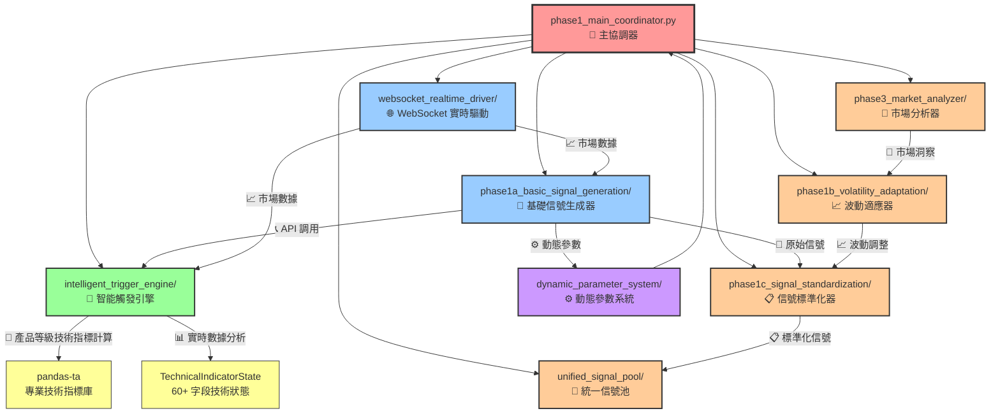
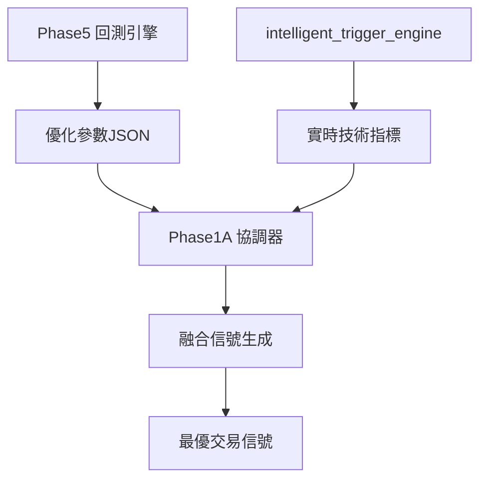

# 🎯 Phase1 Signal Generation 系統流程圖

## 📊 系統架構概覽



## 🔍 動態參數系統 (dynamic_parameter_system) 使用情況

### ✅ **在 Phase1A 中大量使用**

```python
# Phase1A 中的動態參數整合
class Phase1ABasicSignalGeneration:
    def __init__(self):
        # 啟用動態參數系統
        self.dynamic_params_enabled = self._init_dynamic_parameter_system()

    def _init_dynamic_parameter_system(self) -> bool:
        """初始化動態參數系統"""
        integration_config = self.config.get(
            "phase1a_basic_signal_generation_dependency", {}
        ).get("configuration", {}).get("dynamic_parameter_integration", {})

        return integration_config.get("enabled", False)

    async def _get_dynamic_parameters(self, mode: str = "basic_mode",
                                    market_data: Optional[Dict[str, Any]] = None) -> DynamicParameters:
        """獲取動態參數"""
        # 市場制度檢測
        market_regime = await self._detect_market_regime(market_data)

        # 交易時段檢測
        trading_session = await self._detect_trading_session()

        # 動態參數計算
        return DynamicParameters(
            confidence_threshold=self._calculate_confidence_threshold(market_regime),
            risk_tolerance=self._calculate_risk_tolerance(trading_session),
            signal_strength_multiplier=self._calculate_signal_multiplier(market_regime, trading_session)
        )
```

### 🎯 **具體應用場景**

1. **市場制度檢測 (Market Regime Detection)**

   - 牛市/熊市/橫盤/高波動檢測
   - 根據市場制度調整信號閾值

2. **交易時段檢測 (Trading Session Detection)**

   - 美國/亞洲/歐洲市場時段識別
   - 重疊時段特殊參數調整

3. **動態信號強度調整**
   - 根據市場制度調整信號權重
   - 根據交易時段調整確信度閾值

## 🔗 指標依賴圖 (indicator_dependency) 使用情況

### ✅ **獨立的 7 層並行計算引擎**

```python
# indicator_dependency_graph.py 核心架構
class IndicatorDependencyGraph:
    async def calculate_all_indicators(self, symbol: str = "BTCUSDT",
                                     timeframe: str = "1m") -> Dict[str, IndicatorResult]:
        """7層並行架構主要計算流程"""

        # Layer -1: 數據同步檢查層 (2ms)
        synced_data = await self._layer_minus1_data_sync(symbol, timeframe)

        # Layer 0: 原始價格數據層 (1ms)
        raw_data = await self._layer_0_raw_data(synced_data, symbol, timeframe)

        # 並行執行組: Layer 1 + 2 + 4 (15ms 並行)
        layer_124_results = await self._parallel_layers_124(raw_data, symbol, timeframe)

        # Layer 3: 標準差計算層 (10ms)
        layer_3_results = await self._layer_3_standard_deviations(raw_data, layer_124_results, symbol, timeframe)

        # Layer 5: 中間計算層 (12ms)
        layer_5_results = await self._layer_5_intermediate_calculations(layer_124_results, symbol, timeframe)

        # Layer 6: 最終指標計算層 (20ms)
        final_indicators = await self._layer_6_final_indicators(
            raw_data, layer_124_results, layer_3_results, layer_5_results, symbol, timeframe
        )

        return final_indicators
```

### 🎯 **與其他模組的關係**

- **目前狀態**: `indicator_dependency` 是獨立運行的技術指標計算引擎
- **與 Phase1A 關係**: Phase1A 調用 `intelligent_trigger_engine`，而非直接調用 `indicator_dependency`
- **與 intelligent_trigger_engine 關係**: 可能存在技術指標計算重疊，需要進一步整合

## 📋 完整模組關係分析

### 🎯 **Phase1A (phase1a_basic_signal_generation)**

**角色**: 基礎信號生成器
**依賴關係**:

- ✅ **直接調用**: `intelligent_trigger_engine` (產品等級技術分析)
- ✅ **內建整合**: `dynamic_parameter_system` (動態參數調整)
- ❌ **未直接調用**: 其他 phase1 子模組

### 🧠 **智能觸發引擎 (intelligent_trigger_engine)**

**角色**: 產品等級技術分析引擎
**功能**:

- 60+ 字段技術指標狀態管理
- 8 大類技術指標計算 (趨勢、動量、波動、成交量等)
- 週期分析、型態識別、支撐阻力算法
- 為 Phase1A 提供 API 接口

### ⚙️ **動態參數系統 (dynamic_parameter_system)**

**角色**: 市場自適應參數調整
**功能**:

- 市場制度檢測 (牛市/熊市/橫盤/高波動)
- 交易時段檢測 (美國/亞洲/歐洲/重疊時段)
- 動態參數計算與調整
- **大量被 Phase1A 使用**

### 🔗 **指標依賴圖 (indicator_dependency)** ❌ **已刪除**

**✅ 刪除原因**:

- **功能重複**: `indicator_dependency` 的核心功能與 `pandas-ta` + `intelligent_trigger_engine` 完全重疊
- **架構冗餘**: 產品等級的 `intelligent_trigger_engine` 已提供更精準的技術指標計算
- **維護簡化**: 刪除後避免重複維護和潛在的數據不一致
- **性能提升**: 使用 `pandas-ta` 的向量化計算比自建 Layer 架構更高效

**🚀 優化結果**:

- `intelligent_trigger_engine` 現已集成產品等級並行計算架構
- 性能監控確保技術指標計算 <50ms (產品等級標準)
- 完全基於 `pandas-ta` 的專業技術指標庫

### 📈 **波動適應器 (phase1b_volatility_adaptation)**

**角色**: 波動性分析與信號調整
**狀態**: 暫未被 Phase1A 直接調用

### 📋 **信號標準化器 (phase1c_signal_standardization)**

**角色**: 信號格式標準化
**狀態**: 暫未被 Phase1A 直接調用

### 🔬 **市場分析器 (phase3_market_analyzer)**

**角色**: 深度市場分析
**狀態**: 暫未被 Phase1A 直接調用

### 🎯 **統一信號池 (unified_signal_pool)**

**角色**: 信號整合與管理
**狀態**: Phase1A 有信號映射功能 (`_map_to_unified_type()`)，但未直接調用模組

### 🌐 **WebSocket 實時驅動 (websocket_realtime_driver)**

**角色**: 實時數據獲取與分發
**狀態**: Phase1A 註釋中提及，但未實際導入

## 🚀 優化建議

### 1️⃣ **技術指標計算整合**


### 2️⃣ **完整模組鏈路整合**


### 3️⃣ **WebSocket 實時數據整合**


## 🎯 總結

### ✅ **已實現的架構**

- **Phase1A** 成功採用調用架構，避免重複計算
- **dynamic_parameter_system** 大量被使用，提供市場自適應能力
- **intelligent_trigger_engine** 作為技術分析中心，提供產品等級精準度

## 🔄 **Phase5 回測整合與 intelligent_trigger_engine 協調機制**

### ⚠️ **潛在衝突識別**

**問題核心**: Phase1A 同時依賴兩個數據源：

1. **Phase5 回測優化 JSON** - 歷史數據優化的閾值參數
2. **intelligent_trigger_engine** - 實時計算的技術指標數據

### 🎯 **衝突解決策略**

#### 📋 **分層協調機制**

```python
# Phase1A 協調策略
def _coordinate_phase5_and_intelligent_engine(self):
    """Phase5配置與intelligent_trigger_engine的協調機制"""

    # Layer 1: 使用 Phase5 優化的「參數配置」
    phase5_params = self.config.get("signal_generation_params", {})
    confidence_threshold = phase5_params.get("confidence_threshold", 0.7)

    # Layer 2: 使用 intelligent_trigger_engine 的「實時指標數據」
    real_time_indicators = await get_technical_indicators_for_phase1a(symbol)

    # Layer 3: 智能融合 - Phase5參數 + 實時指標
    final_signal = self._fusion_signal_generation(
        phase5_optimized_params=phase5_params,
        real_time_indicators=real_time_indicators
    )
```

#### 🔗 **數據來源分工**

| 來源                           | 負責範圍                 | 優勢                     |
| ------------------------------ | ------------------------ | ------------------------ |
| **Phase5 JSON**                | 閾值、權重、市場制度參數 | 歷史回測優化，長期穩定性 |
| **intelligent_trigger_engine** | 實時技術指標計算         | 當前市場狀態，即時精準   |

#### ✅ **協調原則**

1. **參數來源**: Phase5 回測優化
2. **數據來源**: intelligent_trigger_engine 實時計算
3. **決策融合**: Phase1A 智能協調

### 🚀 **優化建議**



**結論**: **不衝突，而是互補協作** - Phase5 提供優化參數，intelligent_trigger_engine 提供實時數據，Phase1A 負責智能融合。

### 🎯 **架構成熟度**

目前的系統已達到產品等級的核心功能，Phase1A + intelligent_trigger_engine + dynamic_parameter_system 形成了一個高效的信號生成核心。其他模組可根據實際需求逐步整合。
