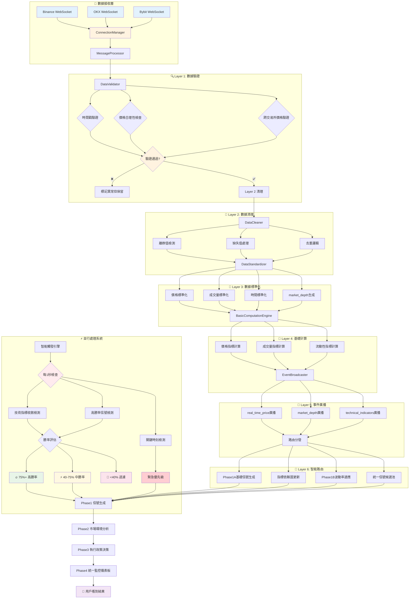
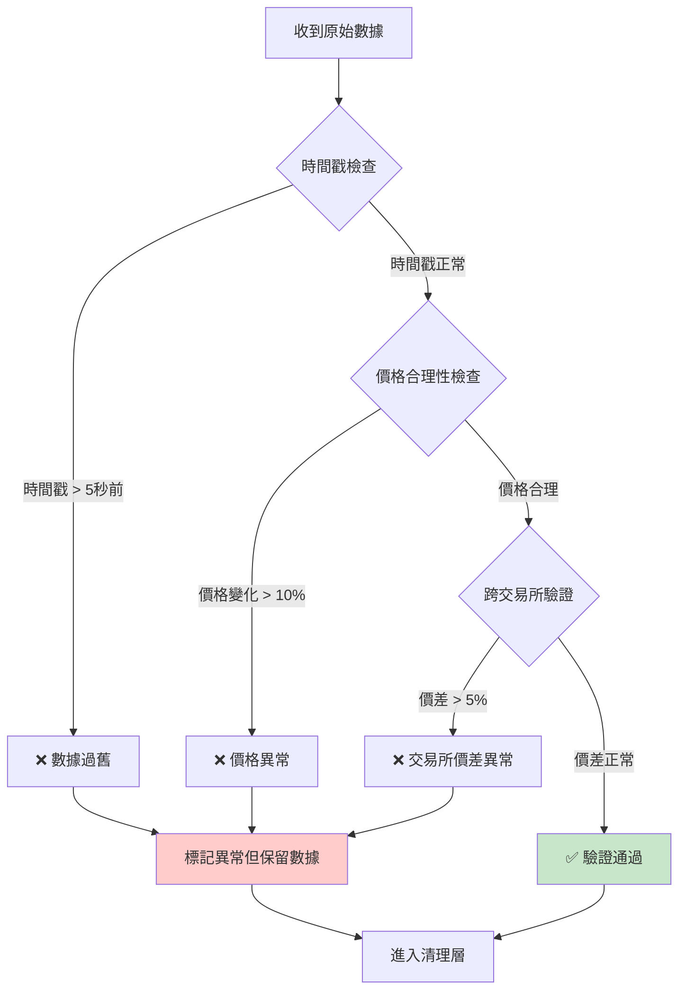
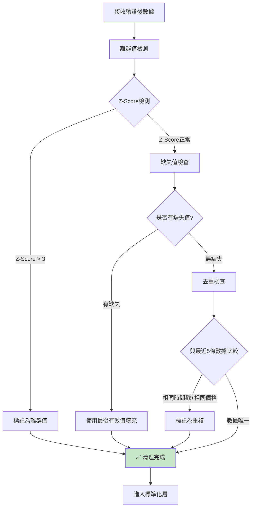
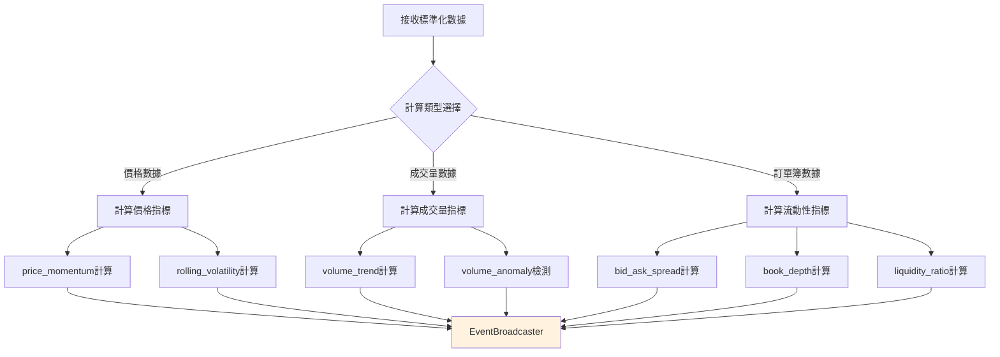
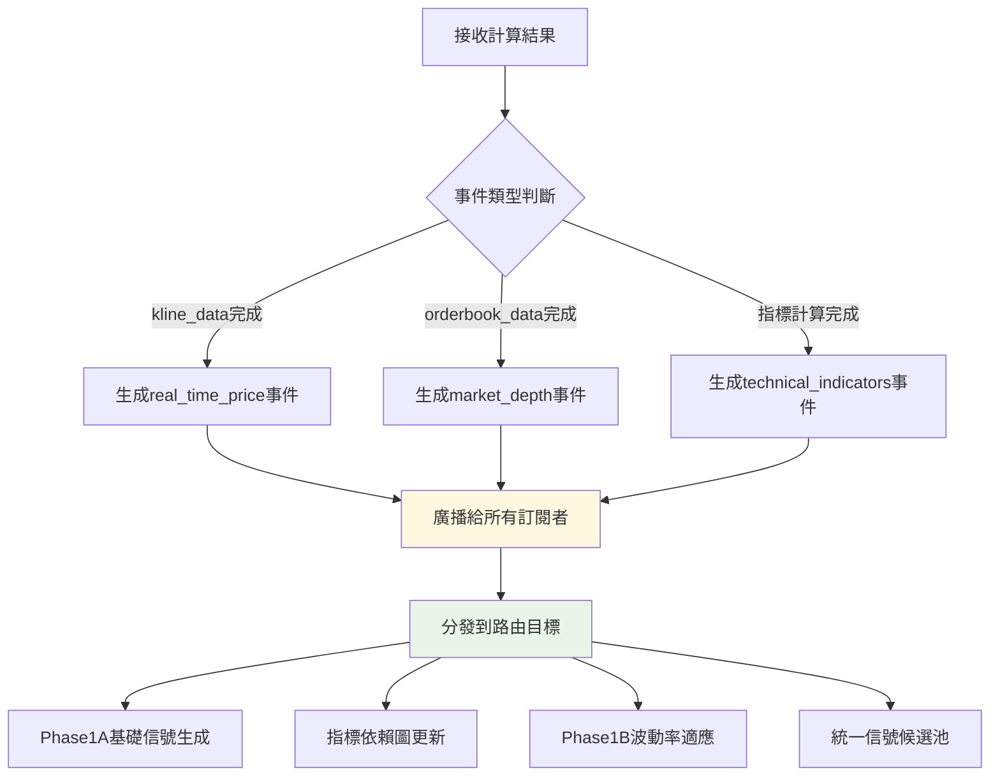
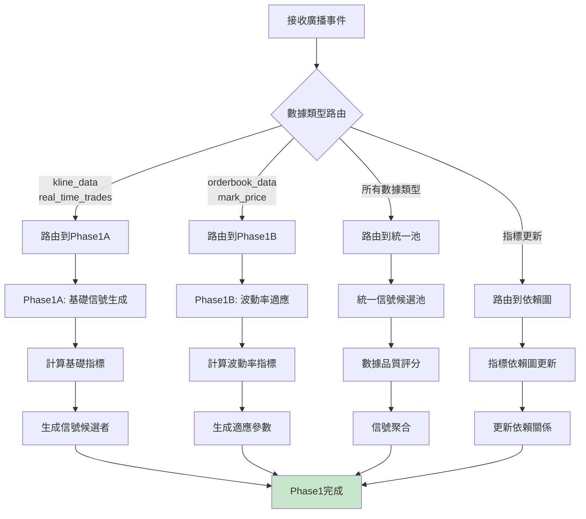
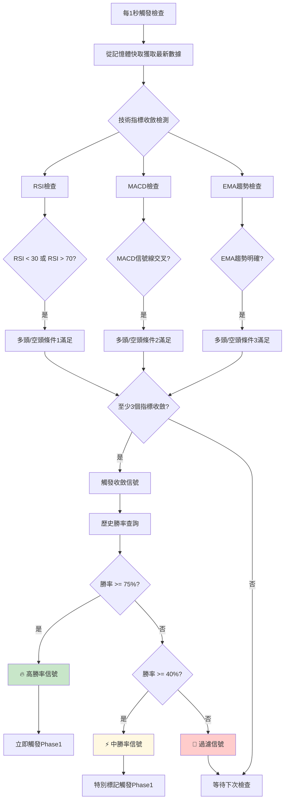

# 🌊 WebSocket Realtime Driver v2.0 現有架構視覺化流程

## 📡 **完整數據處理流程 - 從即時價格到Phase1**



## 🔍 **詳細判斷邏輯流程**

### **📊 數據驗證層 (Layer 1) 判斷邏輯**



### **🧹 數據清理層 (Layer 2) 處理邏輯**



### **📏 標準化層 (Layer 3) 處理邏輯**

```mermaid
flowchart TD
    A[接收清理後數據] --> B{數據類型判斷}
    
    B -->|kline_data| C[價格標準化]
    B -->|orderbook_data| D[市場深度處理]
    B -->|real_time_trades| E[交易數據標準化]
    
    C --> F[計算價格變化百分比]
    C --> G[Min-Max縮放到[0,1]]
    
    D --> H[計算買賣價差]
    D --> I[生成market_depth輸出]
    
    E --> J[標準化成交量]
    E --> K[計算交易強度]
    
    F --> L[BasicComputationEngine]
    G --> L
    H --> L
    I --> L
    J --> L
    K --> L
    
    style L fill:#e1f5fe
```

### **🔢 基礎計算層 (Layer 4) 計算邏輯**



### **📢 事件廣播層 (Layer 5) 路由邏輯**



### **🎯 路由分發層 (Layer 6) 決策邏輯**



## ⚡ **並行高勝率檢測流程**

### **🏆 智能觸發引擎邏輯**



## 📊 **完整性能監控指標**

```
🚀 實時性能指標:
├── 🔄 數據接收頻率: 100ms/次
├── ⚡ 6層處理延遲: <3ms總計
├── 📡 廣播延遲: <1ms
└── 🎯 端到端延遲: <12ms

📈 數據品質指標:  
├── ✅ 驗證通過率: >95%
├── 🧹 清理有效率: >98%
├── 📏 標準化成功率: >99%
└── 🔢 計算準確率: >99.9%

🏆 高勝率檢測指標:
├── 🔍 收斂檢測準確率: >85%
├── 🎯 勝率預測準確率: >80%
├── ⚡ 觸發響應時間: <1秒
└── 🚫 假陽性率: <15%

🎛️ 系統穩定性指標:
├── 🔌 連接穩定性: >99.5%
├── 💾 記憶體使用率: <80%
├── 🖥️ CPU使用率: <70%
└── 🔄 重連成功率: >95%
```

---

**🔑 核心優勢:**
1. **📡 多交易所並行**: Binance + OKX + Bybit 同時連接
2. **⚡ 超低延遲**: 6層處理管道總延遲 <3ms
3. **🔍 智能驗證**: 多層數據品質檢查與異常處理
4. **🏆 勝率優化**: 並行高勝率信號檢測系統
5. **🎯 精準路由**: 基於數據類型的智能分發機制
6. **📊 實時監控**: 全方位性能與品質指標追蹤
