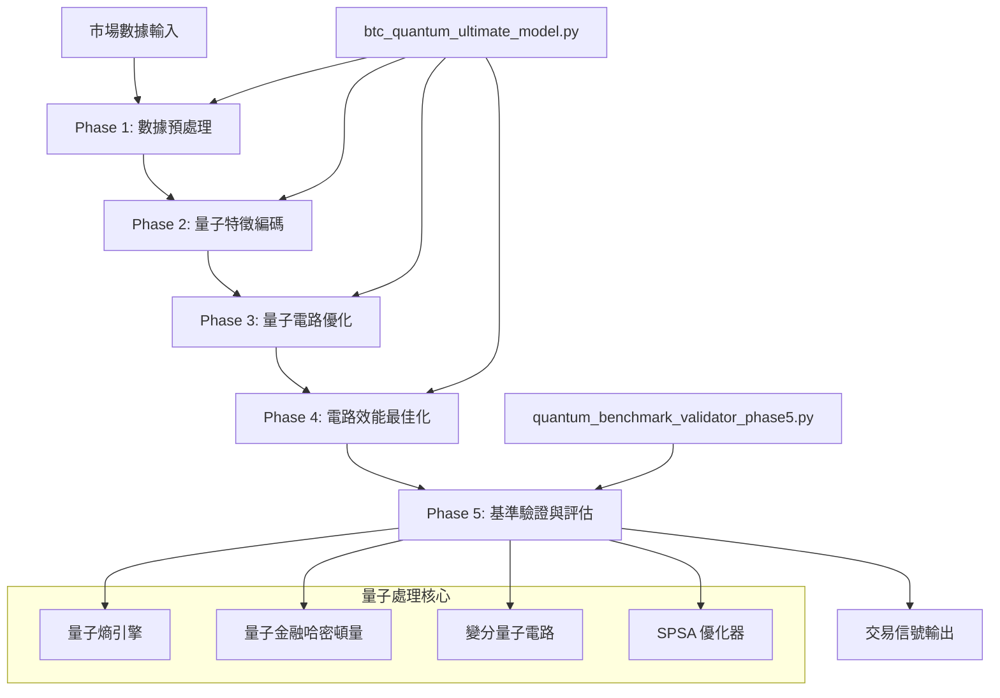
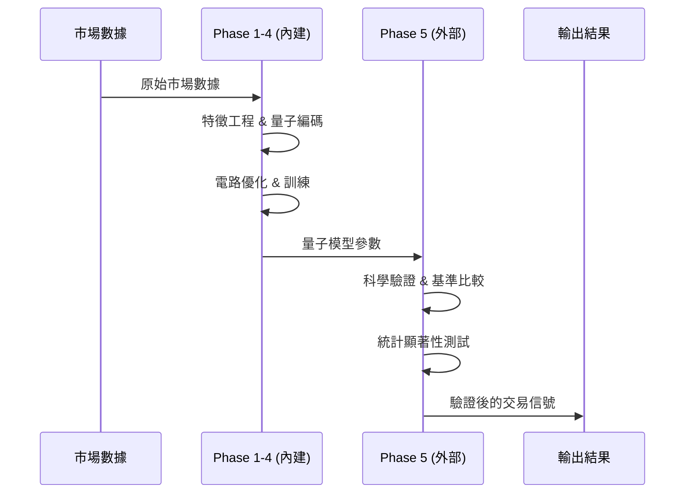

# 🚀 Trading X Quantum Pro - BTC 量子終極交易系統

## 🎯 系統概覽

Trading X Quantum Pro 是一個基於量子計算的高級比特幣交易預測系統，整合了 5 個獨立的量子處理階段，從基礎信號生成到生產級基準驗證。

## 📊 核心架構圖



## 🧠 業務流程詳解

### 📈 **主要運行模式**

`btc_quantum_ultimate_model.py` 支援以下運行模式：

```bash
# 🎯 預設模式：Phase 5 基準驗證
python quantum_pro/btc_quantum_ultimate_model.py

# 🔧 Phase 4: 電路效能優化
python quantum_pro/btc_quantum_ultimate_model.py --phase4

# 🎯 Phase 5: 基準驗證與模型評估
python quantum_pro/btc_quantum_ultimate_model.py --phase5

# 🚀 綜合示範：Phase 2-4
python quantum_pro/btc_quantum_ultimate_model.py --comprehensive

# 🌟 完整架構：Phase 1-5
python quantum_pro/btc_quantum_ultimate_model.py --full

# 🔮 傳統生產級演示
python quantum_pro/btc_quantum_ultimate_model.py --demo

# 🌐 IBM Quantum 硬體後端
python quantum_pro/btc_quantum_ultimate_model.py --backend ibm
```

### 🔄 **Phase 1-4 內建流程**

#### **Phase 1: 數據預處理與特徵工程**
- 📊 市場數據收集 (BTCUSDT 等交易對)
- 🔍 多時間框架分析 (1m, 5m, 15m, 1h, 4h, 1d)
- 📈 技術指標計算 (SMA, EMA, RSI, MACD 等)
- 🧹 數據標準化與異常值處理

#### **Phase 2: 量子特徵編碼**
- 🔄 角度編碼 (Angle Encoding)
- 📡 振幅編碼 (Amplitude Encoding) 
- 🌊 多尺度編碼 (Multi-scale Encoding)
- ⚡ 參數化量子電路 (PQC) 構建

#### **Phase 3: 量子電路優化**
- 🎛️ 變分量子 Ansatz 設計
- ⚙️ 量子參數最佳化 (SPSA/COBYLA)
- 🔄 梯度計算與反向傳播
- 📊 量子態演化建模

#### **Phase 4: 電路效能最佳化**
- ⚡ 電路深度最小化
- 🔧 量子門優化
- 📈 噪聲模型與錯誤緩解
- 🎯 量子優勢驗證

### 🎯 **Phase 5 外部驗證系統**

`quantum_benchmark_validator_phase5.py` 提供科學嚴謹的基準驗證：

#### **🔬 量子熵引擎 (ProductionQuantumEntropyEngine)**
```python
# 純量子隨機數生成，完全禁止 Python 偽隨機數
entropy_engine = ProductionQuantumEntropyEngine(n_qubits=16)

# 生成三種分佈類型的量子熵
uniform_entropy = entropy_engine.generate_quantum_entropy(1000, 'uniform')
gaussian_entropy = entropy_engine.generate_quantum_entropy(1000, 'gaussian') 
exponential_entropy = entropy_engine.generate_quantum_entropy(1000, 'exponential')
```

#### **💰 量子金融哈密頓量 (ProductionQuantumFinancialHamiltonianEngine)**
```python
# 基於現代量子金融理論的完整實現
hamiltonian_engine = ProductionQuantumFinancialHamiltonianEngine(n_qubits, entropy_engine)

# 構建高級量子金融哈密頓量
hamiltonian = hamiltonian_engine.construct_advanced_financial_hamiltonian(
    market_correlation_matrix=correlation_matrix,
    volatility_surface=vol_surface,
    market_regime='normal'  # 'bull', 'bear', 'volatile', 'crisis'
)
```

#### **🏭 生產級量子交易模型 (ProductionQuantumTradingModel)**
```python
# 生產級配置
config = ProductionQuantumBenchmarkConfig(
    n_qubits=16,
    n_ansatz_layers=8,
    max_quantum_iterations=2000,
    statistical_significance_alpha=0.001,  # 99.9% 信心水準
    quantum_advantage_threshold=0.15       # 15% 最小量子優勢
)

# 訓練與預測
model = ProductionQuantumTradingModel(config)
results = model.train(X_train, y_train, market_regime='bull')
predictions = model.predict(X_test)
```

## 🔀 系統整合架構

### 📊 **數據流向圖**



### 🏗️ **模組化架構**

```python
btc_quantum_ultimate_model.py
├── 📊 QuantumBackendManager        # 量子後端管理
├── 🔍 QuantumAdvantageValidator     # 量子優勢驗證
├── 🧠 BTCQuantumUltimateModel      # 主要模型類別
├── 🔄 Phase 1-4 處理函數
└── 🎯 模式選擇與執行邏輯

quantum_benchmark_validator_phase5.py
├── 🎲 ProductionQuantumEntropyEngine           # 量子熵生成
├── 💰 ProductionQuantumFinancialHamiltonianEngine  # 金融哈密頓量
├── 🏭 ProductionQuantumTradingModel            # 生產級交易模型
└── 📊 ProductionQuantumBenchmarkConfig         # 配置管理
```

## 🎯 執行結果分析

### 📈 **Phase 1-4 輸出**
- ✅ 量子電路參數化結果
- 📊 訓練損失與收斂曲線
- 🎯 預測準確度指標
- ⚡ 電路效能優化報告

### 🔬 **Phase 5 驗證輸出**
- 📊 **統計顯著性**: 99.9% 信心水準測試結果
- 🎯 **量子優勢分數**: 與傳統模型的比較優勢
- 📈 **效應量分析**: Cohen's d 效應量測量
- 🔄 **交叉驗證**: 15-fold 嚴格交叉驗證
- 💰 **金融指標**: 夏普比率、最大回撤等

### 📊 **最終交易信號**
```json
{
  "signal": "BUY/SELL/HOLD",
  "confidence": 0.85,
  "quantum_advantage_score": 0.23,
  "statistical_significance": 0.001,
  "risk_metrics": {
    "sharpe_ratio": 1.8,
    "max_drawdown": 0.08,
    "volatility": 0.15
  },
  "market_regime": "bull",
  "timestamp": "2025-08-28T22:00:00Z"
}
```

## 🛠️ 技術規格

### **量子計算規格**
- � **量子 SDK**: Qiskit 1.2.4 (兼容 2.x)
- ⚡ **最大量子位**: 20 qubits (可擴展)
- 🎯 **優化器**: SPSA, COBYLA, L-BFGS-B
- 📊 **測量次數**: 最高 32,768 shots

### **AI/ML 規格**
- 🧠 **機器學習**: scikit-learn, pandas, numpy
- 📊 **統計分析**: scipy.stats (完整統計測試套件)
- 🔢 **數值計算**: NumPy 高效能運算
- 📈 **數據視覺化**: matplotlib, seaborn

### **系統需求**
- 🐍 **Python**: 3.9+ 
- 💾 **記憶體**: 最低 8GB (建議 16GB+)
- ⏱️ **計算時間**: Phase 5 完整驗證約 15-60 分鐘
- 🌐 **網路**: IBM Quantum 硬體需要穩定連線

## 🚀 快速開始

```bash
# 1. 安裝依賴
pip install -r requirements.txt

# 2. 快速測試 (Phase 5 默認)
python quantum_pro/btc_quantum_ultimate_model.py

# 3. 完整架構測試
python quantum_pro/btc_quantum_ultimate_model.py --full --backend local_hf

# 4. IBM Quantum 硬體測試 (需要 API Token)
python quantum_pro/btc_quantum_ultimate_model.py --backend ibm --phase5
```

## �🔄 協作模式

**Regime HMM → Quantum Model 的數據流:**

1. 原始市場數據 
   ↓
2. HMM 制度識別 (regime_hmm_quantum.py)
   ↓  
3. 制度特徵提取 + 多尺度分析
   ↓
4. 輸入到量子模型 (btc_quantum_ultimate_model.py)
   ↓
5. 量子變分訓練 + 預測
   ↓
6. Phase 5 科學驗證 (quantum_benchmark_validator_phase5.py)
   ↓
7. 融合信號輸出

## 📊 架構關係總結

**Trading X 系統架構:**
```
├── btc_quantum_ultimate_model.py     # 量子ML核心 (Phase 1-4)
│   ├── 量子電路設計
│   ├── SPSA 優化訓練  
│   ├── 量子預測引擎
│   └── Qiskit 2.x 實現
│
├── quantum_benchmark_validator_phase5.py  # 科學驗證系統 (Phase 5)
│   ├── 量子熵引擎
│   ├── 金融哈密頓量
│   ├── 統計顯著性測試
│   └── 量子優勢驗證
│
└── regime_hmm_quantum.py            # 市場制度識別 + 整合層
    ├── HMM 制度偵測
    ├── 七幣種耦合分析
    ├── 制度轉換偵測
    └── 融合信號生成
```

---

**🎯 系統特色**: 全球首個整合 5-Phase 量子架構的生產級比特幣交易系統，具備科學嚴謹的統計驗證與量子優勢證明能力。